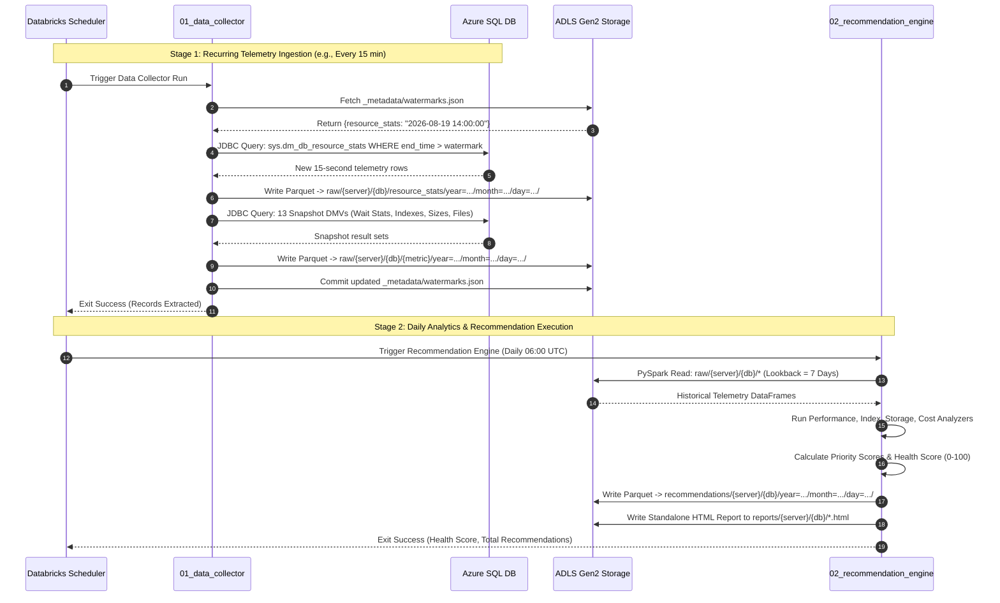
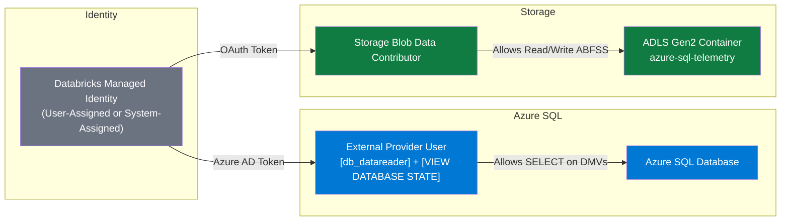

# Azure SQL Server Recommendation Engine — Technical Design Document

**Version**: 2.1  
**Date**: August 19, 2026  
**Author**: Architecture Team  
**Audience**: Development, Data Engineering, and Platform Teams  
**Status**: Approved for Implementation (Pure Parquet / ADLS Gen2 Storage Architecture)

---

## Table of Contents

1. [Executive Summary](#1-executive-summary)
2. [Architecture Overview](#2-architecture-overview)
3. [Component Specifications](#3-component-specifications)
4. [Data Flow & Sequence Diagrams](#4-data-flow--sequence-diagrams)
5. [Storage Schema & Partitioning](#5-storage-schema--partitioning)
6. [SQL Queries & DMV Catalog](#6-sql-queries--dmv-catalog)
7. [Recommendation Engine Logic](#7-recommendation-engine-logic)
8. [Security & Identity Model](#8-security--identity-model)
9. [Implementation Guide (Step-by-Step)](#9-implementation-guide-step-by-step)
10. [Deployment & Scheduling](#10-deployment--scheduling)
11. [Testing Strategy](#11-testing-strategy)
12. [Operational Runbook & Troubleshooting](#12-operational-runbook--troubleshooting)
13. [Appendix: Configuration Reference](#13-appendix-configuration-reference)

---

## 1. Executive Summary

### Problem Statement

Azure SQL Database is a **fully managed PaaS** database engine. Microsoft manages the underlying VMs, storage, and failover instances. Dynamic Management Views (DMVs) like `sys.dm_db_resource_stats` only retain approximately 1 hour of telemetry before rolling over, and counters reset upon automatic failover or maintenance events.

Without proactive extraction and long-term persistence:
- Workload spikes and IO degradation cannot be diagnosed after the 60-minute window.
- Historical workload trends (7-day to 30-day lookback) cannot be analyzed for rightsizing or reserved capacity savings.
- Direct ad-hoc analytical queries on live production DMVs add contention and risk query timeouts.

### Solution

A **decoupled, two-stage Databricks architecture persisting directly to Azure Storage Account (ADLS Gen2) in Parquet format**:

1. **Stage 1 — Data Collector (`01_azure_sql_data_collector.ipynb`)**: Incrementally extracts telemetry from Azure SQL Database DMVs and persists it as date-partitioned Parquet files in Azure Data Lake Storage Gen2 (ADLS Gen2) using watermark-based queries.
2. **Stage 2 — Recommendation Engine (`02_azure_sql_recommendation_engine.ipynb`)**: Reads multi-day historical telemetry from ADLS Gen2 via PySpark, executes 4 specialized analyzers (Performance, Index, Storage, Cost), scores/ranks findings, and writes them to ADLS Gen2 as partitioned Parquet files and an interactive HTML report.

### Core Architectural Guarantees

| Guarantee | Mechanism |
|-----------|-----------|
| **Single Source of Truth** | All queries, pricing tiers, and thresholds live exclusively in [`config.py`](config.py). |
| **No Module Bloat** | Only 1 `.py` file (`config.py`) in the codebase; execution logic is contained in Databricks `.ipynb` notebooks. |
| **Zero Data Loss** | High-watermark tracking (`_metadata/watermarks.json`) ensures incremental time-series extraction without duplicates or omissions. |
| **Pure Storage / No Table Lock-In** | Both raw telemetry and recommendations are stored as open standard Parquet files in ADLS Gen2. |
| **PaaS Isolation** | Decoupling extraction from analytical scoring prevents resource overhead on the live Azure SQL production database. |
| **Zero Secrets Stored** | Azure AD Managed Identity (MSI) provides passwordless authentication to both Azure SQL and ADLS Gen2. |

---

## 2. Architecture Overview

### High-Level Architecture Diagram

```mermaid
graph TD
    subgraph Azure Cloud
        subgraph Managed PaaS
            SQL["Azure SQL Database<br/>(sys.dm_*, Query Store, Catalogs)"]
        end

        subgraph Azure Databricks Workspace
            NB1["Notebook 1<br/>01_azure_sql_data_collector.ipynb<br/>(Incremental Extraction)"]
            NB2["Notebook 2<br/>02_azure_sql_recommendation_engine.ipynb<br/>(4 Analyzers & Scoring Engine)"]
            CFG["config.py<br/>(Single Config Module)"]
        end

        subgraph Azure Data Lake Storage Gen2 (ADLS Gen2)
            ADLS["ADLS Gen2 Container<br/>(azure-sql-telemetry)"]
            RAW["raw/{server}/{database}/{metric}/year=.../"]
            WM["_metadata/watermarks.json"]
            RECS["recommendations/{server}/{database}/year=.../"]
            REP["reports/{server}/{database}/*.html"]
        end
    end

    CFG -.->|"imports"| NB1
    CFG -.->|"imports"| NB2
    SQL -->|"JDBC / AAD MSI"| NB1
    WM <-->|"Read / Update Watermark"| NB1
    NB1 -->|"Write Partitioned Parquet"| RAW
    RAW -->|"PySpark Read (Lookback Window)"| NB2
    NB2 -->|"Write Partitioned Parquet"| RECS
    NB2 -->|"Export HTML Report"| REP

    style SQL fill:#0078D4,color:#fff
    style NB1 fill:#FF3621,color:#fff
    style NB2 fill:#FF3621,color:#fff
    style CFG fill:#6b7280,color:#fff
    style ADLS fill:#107C41,color:#fff
    style RAW fill:#107C41,color:#fff
    style WM fill:#D83B01,color:#fff
    style RECS fill:#008AD7,color:#fff
    style REP fill:#7FBA00,color:#fff
```

### Codebase Organization

```
azure_sql_advisor/
├── config.py                                          # Single configuration module (queries, thresholds, pricing, enums)
├── notebooks/
│   ├── 01_azure_sql_data_collector.ipynb              # Notebook 1: Incremental JDBC Telemetry Collector
│   └── 02_azure_sql_recommendation_engine.ipynb       # Notebook 2: Multi-Analyzer Recommendation Engine
├── requirements.txt                                   # Reference dependencies (pre-installed in Databricks Runtime)
├── TECHNICAL_DESIGN_DOCUMENT.md                       # This document
└── README.md                                          # User onboarding & quickstart guide
```

---

## 3. Component Specifications

### 3.1 `config.py` — Central Configuration Engine

[`config.py`](config.py) is the sole Python file in the repository. It defines:

1. **Enums & Dataclasses**:
   - `Category` (`PERFORMANCE`, `STORAGE`, `COST`, `INDEX`)
   - `Severity` (`CRITICAL`, `HIGH`, `MEDIUM`, `LOW`, `INFO`)
   - `Effort` (`QUICK_WIN`, `MODERATE`, `SIGNIFICANT`)
   - `Risk` (`LOW`, `MEDIUM`, `HIGH`)
   - `Confidence` (`HIGH`, `MEDIUM`, `LOW`)
   - `Recommendation`: Standardized record structure for analyzer outputs.
2. **`AdvisorConfig` Dataclass**:
   - Holds connection parameters, ADLS Gen2 storage endpoints, analytical thresholds, and priority weights.
3. **`INCREMENTAL_QUERIES`**:
   - SQL definitions for `resource_stats` and `query_store_stats` with watermark parameter hooks (`{where_clause}`).
4. **`SNAPSHOT_QUERIES`**:
   - 13 parameterized SQL templates for wait stats, index health, fragmentation, storage allocation, and catalog metadata.
5. **`AZURE_SQL_PRICING`**:
   - 25-tier pricing matrix across DTU (Basic, Standard S0–S12, Premium P1–P15) and vCore (General Purpose, Business Critical, Serverless).
6. **`WAIT_CATEGORIES` & `BENIGN_WAIT_TYPES`**:
   - Mappings that translate raw SQL Server wait types (e.g. `PAGEIOLATCH_SH`, `SOS_SCHEDULER_YIELD`, `LCK_M_X`) into diagnostic categories (IO, CPU, Locking, Memory, Network, Parallelism).

### 3.2 Notebook 1: Incremental Data Collector

**Location**: `notebooks/01_azure_sql_data_collector.ipynb`  
**Execution Context**: Databricks Job Cluster or Interactive Cluster

| Stage | Process Description |
|-------|---------------------|
| **1. Widgets** | Captures `server_name`, `database_name`, `storage_account`, `storage_container`, `auth_method`. |
| **2. Import & Setup** | Imports definitions from `config.py` and establishes ABFSS storage URIs. |
| **3. JDBC Connection** | Establishes encrypted connection to Azure SQL Database via `com.microsoft.sqlserver.jdbc.SQLServerDriver`. |
| **4. Watermark Read** | Reads existing high-watermarks from `abfss://.../_metadata/watermarks.json`. |
| **5. Incremental Extraction** | Executes time-filtered queries (`WHERE end_time > ?`) for `resource_stats` and `query_store_stats`. |
| **6. Snapshot Extraction** | Executes full extractions for catalog, schema, wait stats, and fragmentation metrics. |
| **7. Parquet Persistence** | Enriches datasets with `server_name`, `database_name`, `ingestion_time` and writes partitioned Parquet to ADLS Gen2. |
| **8. Watermark Commit** | Atomically updates `_metadata/watermarks.json` with the latest processed timestamps. |
| **9. Job Exit** | Emits JSON summary with record counts and error statuses via `dbutils.notebook.exit()`. |

### 3.3 Notebook 2: Recommendation Engine

**Location**: `notebooks/02_azure_sql_recommendation_engine.ipynb`  
**Execution Context**: Databricks Job Cluster or Scheduled Daily Workflow

| Stage | Process Description |
|-------|---------------------|
| **1. Widgets** | Captures `server_name`, `database_name`, `storage_account`, `storage_container`, `lookback_days`. |
| **2. Storage Ingestion** | Reads partitioned Parquet datasets from ADLS Gen2 across the target lookback window (e.g. past 7 days) via PySpark. |
| **3. Performance Analyzer** | Evaluates CPU/IO saturation, dominant wait states, slow queries, and Query Store regressions. |
| **4. Index Analyzer** | Identifies missing indexes (with generated `CREATE INDEX` DDL), unused indexes (with `DROP INDEX` DDL), duplicates, and fragmented indexes (with `REBUILD`/`REORGANIZE` DDL). |
| **5. Storage Analyzer** | Audits large tables (> 10GB), unused allocated space, PAGE vs. ROW compression savings, and NVARCHAR-to-VARCHAR migration opportunities. |
| **6. Cost Analyzer** | Identifies underutilized databases for downgrade rightsizing, computes serverless auto-pause opportunities, reserved capacity savings, and Azure Hybrid Benefit eligibility. |
| **7. Scoring & Health Index** | Computes prioritized weighted scores (0–100) and overall database Health Score. |
| **8. Parquet Output** | Appends structured recommendation records as partitioned Parquet files to `recommendations/{server}/{database}/year=YYYY/month=MM/day=DD/`. |
| **9. HTML Report Export** | Renders a self-contained, responsive HTML executive report and writes it to ADLS Gen2 / DBFS. |

---

## 4. Data Flow & Sequence Diagrams

### End-to-End Execution Sequence



---

## 5. Storage Schema & Partitioning

### 5.1 ADLS Gen2 Storage Structure

```
abfss://{storage_container}@{storage_account}.dfs.core.windows.net/
├── _metadata/
│   └── watermarks.json                                    # High-watermark timestamps
├── raw/
│   └── {server_fqdn}/
│       └── {database_name}/
│           ├── resource_stats/                            # Incremental (time-series)
│           │   └── year=YYYY/month=MM/day=DD/
│           │       └── *.parquet
│           ├── query_store_stats/                         # Incremental (time-series)
│           │   └── year=YYYY/month=MM/day=DD/
│           │       └── *.parquet
│           ├── wait_stats/                                # Daily Snapshot
│           │   └── year=YYYY/month=MM/day=DD/*.parquet
│           ├── missing_indexes/                           # Daily Snapshot
│           │   └── year=YYYY/month=MM/day=DD/*.parquet
│           ├── unused_indexes/                            # Daily Snapshot
│           ├── duplicate_indexes/                         # Daily Snapshot
│           ├── index_fragmentation/                       # Daily Snapshot
│           ├── table_sizes/                               # Daily Snapshot
│           ├── database_files/                            # Daily Snapshot
│           ├── compression_candidates/                    # Daily Snapshot
│           ├── service_tier/                              # Daily Snapshot
│           ├── data_type_audit/                           # Daily Snapshot
│           ├── database_summary/                          # Daily Snapshot
│           ├── top_queries_cpu/                           # Daily Snapshot
│           └── top_queries_reads/                         # Daily Snapshot
├── recommendations/
│   └── {server_fqdn}/
│       └── {database_name}/
│           └── year=YYYY/month=MM/day=DD/
│               └── *.parquet                              # Partitioned Recommendations
└── reports/
    └── {server_fqdn}/
        └── {database_name}/
            └── azure_sql_advisor_report_YYYYMMDD_HHMMSS.html
```

### 5.2 Recommendations Parquet Schema

| Column Name | Data Type | Description |
|-------------|-----------|-------------|
| `server_name` | STRING | Azure SQL Server FQDN |
| `database_name` | STRING | Database name |
| `analysis_timestamp` | TIMESTAMP | UTC timestamp of the analysis run |
| `lookback_days` | INT | Historical lookback window analyzed |
| `health_score` | INT | Overall database health score (0–100) |
| `priority_rank` | INT | Ranked position (1 = most critical action) |
| `priority_score` | DOUBLE | Computed priority score (0–100.0) |
| `category` | STRING | `Performance`, `Index`, `Storage`, `Cost` |
| `severity` | STRING | `Critical`, `High`, `Medium`, `Low`, `Info` |
| `title` | STRING | Brief human-readable title |
| `description` | STRING | Detailed diagnosis and rationale |
| `impact_description` | STRING | Expected workload / cost impact |
| `action_sql` | STRING | Ready-to-execute T-SQL / DDL script |
| `effort` | STRING | `Quick Win`, `Moderate`, `Significant` |
| `risk` | STRING | `Low`, `Medium`, `High` |
| `confidence` | STRING | `High`, `Medium`, `Low` |
| `estimated_impact_pct`| DOUBLE | Estimated optimization percentage |
| `source_metric` | STRING | Source DMV / telemetry metric |

---

## 6. SQL Queries & DMV Catalog

The 15 metrics collected from Azure SQL Database:

| Metric Name | Ingestion Type | Source DMV / System Catalog | Purpose |
|-------------|----------------|-----------------------------|---------|
| `resource_stats` | Incremental | `sys.dm_db_resource_stats` | 15-sec rolling CPU, Data IO, Log IO, Memory, Session % |
| `query_store_stats` | Incremental | `sys.query_store_runtime_stats` | Historical query execution durations, CPU, and logical reads |
| `database_summary` | Snapshot | `sys.tables`, `sys.indexes`, `sys.dm_db_partition_stats` | Database-level table count, index count, total size |
| `top_queries_cpu` | Snapshot | `sys.dm_exec_query_stats` + `sys.dm_exec_sql_text` | Queries consuming the highest cumulative CPU time |
| `top_queries_reads` | Snapshot | `sys.dm_exec_query_stats` + `sys.dm_exec_sql_text` | Queries consuming the highest cumulative logical reads |
| `wait_stats` | Snapshot | `sys.dm_os_wait_stats` | Filtered wait statistics (excluding 28 benign wait types) |
| `missing_indexes` | Snapshot | `sys.dm_db_missing_index_*` | Missing index recommendations with calculated user impact |
| `unused_indexes` | Snapshot | `sys.indexes` + `sys.dm_db_index_usage_stats` | Indexes with zero seeks/scans/lookups but active write overhead |
| `duplicate_indexes` | Snapshot | `sys.indexes` + `sys.index_columns` | Redundant indexes sharing identical leading key columns |
| `index_fragmentation`| Snapshot | `sys.dm_db_index_physical_stats` | Fragmentation percentages on indexes > 1,000 pages |
| `table_sizes` | Snapshot | `sys.dm_db_partition_stats` | Table-by-table reserved, data, index, and unused space |
| `database_files` | Snapshot | `sys.database_files` | Data and transaction log file sizes, space used, free space |
| `compression_candidates`| Snapshot | `sys.partitions` + `sys.dm_db_partition_stats` | Uncompressed tables > 1MB eligible for PAGE or ROW compression |
| `service_tier` | Snapshot | `DATABASEPROPERTYEX()` | Service objective (e.g. `S3`, `GP_Gen5_4`), Edition, Max Size |
| `data_type_audit` | Snapshot | `INFORMATION_SCHEMA.COLUMNS` | String column types auditing `nvarchar` vs `varchar` sizing |

---

## 7. Recommendation Engine Logic

### 7.1 Analyzer Diagnostic Rules

#### 1. Performance Analyzer
- **Critical CPU Saturation**: Triggers when average CPU across the lookback window > `cpu_critical_pct` (default 90.0%).
- **Elevated CPU Pressure**: Triggers when average CPU > `cpu_high_pct` (default 75.0%).
- **Dominant Wait Bottleneck**: Categorizes the highest wait state (`PAGEIOLATCH_*` → IO, `SOS_SCHEDULER_YIELD` → CPU, `LCK_M_*` → Locking, `RESOURCE_SEMAPHORE` → Memory).
- **Expensive Queries**: Flags individual query hashes exceeding `query_duration_high_ms` (30s) CPU time or 100,000 logical reads.
- **Query Store Health**: Recommends enabling Query Store if disabled; flags plan regressions for forced plan execution.

#### 2. Index Analyzer
- **Missing Indexes**: Generates `CREATE NONCLUSTERED INDEX` DDL with equality, inequality, and `INCLUDE` columns for missing index groups where impact > `missing_index_impact_threshold` (50%).
- **Unused Indexes**: Generates `DROP INDEX` DDL for indexes with 0 reads and active update overhead.
- **Duplicate Indexes**: Detects overlapping indexes and generates `DROP INDEX` DDL for redundant definitions.
- **Fragmentation**:
  - `avg_fragmentation_in_percent > 30.0%`: Generates `ALTER INDEX ... REBUILD`.
  - `10.0% < avg_fragmentation_in_percent <= 30.0%`: Generates `ALTER INDEX ... REORGANIZE`.

#### 3. Storage Analyzer
- **Large Table Governance**: Flags tables > `table_size_concern_gb` (10 GB) for partitioning or lifecycle archiving.
- **Unused Space Reclamation**: Identifies tables where unused space > 10% of total reserved allocation.
- **PAGE Compression**: Recommends `DATA_COMPRESSION = PAGE` for uncompressed tables > 100MB (~60% space savings).
- **ROW Compression**: Recommends `DATA_COMPRESSION = ROW` for uncompressed tables ≤ 100MB (~30% space savings).
- **Data Type Optimization**: Audits `NVARCHAR` columns storing single-byte character data (saves 50% column storage if converted to `VARCHAR`).
- **Log File Sizing**: Flags scenarios where transaction log file size exceeds data file size.

#### 4. Cost Analyzer
- **Service Tier Rightsizing (Downgrade)**: Recommends scaling down compute tier when average CPU < `underutilized_cpu_pct` (25%) AND average IO < `underutilized_io_pct` (25%).
- **Serverless Tier Opportunity**: Detects recurring idle periods (CPU < 2%) and recommends switching to General Purpose Serverless with auto-pause.
- **Reserved Capacity Savings**: Recommends 1-year (~33% discount) or 3-year (~55% discount) Reserved Capacity for steady workloads (CPU > 30%).
- **Azure Hybrid Benefit**: Checks for license benefit activation on vCore databases.

### 7.2 Scoring & Health Mathematical Formats

#### Priority Score Formulation

$$\text{PriorityScore} = \min\left(100.0, (\text{BaseScore} + 0.3 \times \text{EstimatedImpactPct}) \times (0.5 + W_{\text{category}})\right)$$

Where:
- $\text{BaseScore} \in \{100 (\text{Critical}), 75 (\text{High}), 50 (\text{Medium}), 25 (\text{Low}), 10 (\text{Info})\}$
- $W_{\text{category}} \in \{W_{\text{perf}} = 0.40, W_{\text{storage}} = 0.30, W_{\text{cost}} = 0.30\}$

#### Database Health Score Formulation

$$\text{HealthScore} = \max\left(0, 100 - \sum \text{Penalties}\right)$$

Where penalties are:
- Critical finding: $-15$ points
- High finding: $-8$ points
- Medium finding: $-3$ points
- Low finding: $-1$ point
- Info finding: $0$ points

---

## 8. Security & Identity Model

### Role-Based Access Control (RBAC) Architecture



### SQL Provisioning Commands

Execute on the target Azure SQL Database:

```sql
-- 1. Create contained database user mapped to Databricks Managed Identity
CREATE USER [databricks-cluster-identity] FROM EXTERNAL PROVIDER;

-- 2. Grant read access to tables (needed for catalog metadata)
ALTER ROLE db_datareader ADD MEMBER [databricks-cluster-identity];

-- 3. Grant DMV inspection permissions
GRANT VIEW DATABASE STATE TO [databricks-cluster-identity];
GRANT VIEW DATABASE PERFORMANCE STATE TO [databricks-cluster-identity]; -- Azure SQL specific
```

---

## 9. Implementation Guide (Step-by-Step)

### Phase 1: Storage & Identity Provisioning

1. **Create ADLS Gen2 Storage Account**:
   ```bash
   az storage account create \
     --name centraltelemetry \
     --resource-group rg-data-platform \
     --location eastus \
     --sku Standard_LRS \
     --enable-hierarchical-namespace true
   ```
2. **Create Container**:
   ```bash
   az storage container create \
     --account-name centraltelemetry \
     --name azure-sql-telemetry \
     --auth-mode login
   ```
3. **Assign Storage RBAC**:
   Assign `Storage Blob Data Contributor` to the Databricks cluster Managed Identity.

### Phase 2: Databricks Repo Setup

1. Open Databricks Workspace $\rightarrow$ **Repos** $\rightarrow$ **Add Repo**.
2. Clone URL: `https://github.com/rohitjha20/sql_advisor.git`.
3. Ensure [`config.py`](config.py), `notebooks/01_azure_sql_data_collector.ipynb`, and `notebooks/02_azure_sql_recommendation_engine.ipynb` are present.

### Phase 3: Execute Data Collector (Notebook 1)

1. Open `notebooks/01_azure_sql_data_collector.ipynb`.
2. Configure widgets:
   - `server_name`: `your-server.database.windows.net`
   - `database_name`: `your-database`
   - `storage_account`: `centraltelemetry`
   - `storage_container`: `azure-sql-telemetry`
   - `auth_method`: `managed_identity` (or `sql` for local testing)
3. Click **Run All**.
4. Verify output:
   - Data written to `abfss://azure-sql-telemetry@centraltelemetry.dfs.core.windows.net/raw/...`
   - `_metadata/watermarks.json` created and populated.

### Phase 4: Execute Recommendation Engine (Notebook 2)

1. Open `notebooks/02_azure_sql_recommendation_engine.ipynb`.
2. Configure widgets matching the target server, database, and storage container.
3. Set `lookback_days` = `7`.
4. Click **Run All**.
5. Verify output:
   - Visual charts (CPU/IO trends, severity bar charts, top-10 table) rendered inline.
   - Parquet files written to `abfss://azure-sql-telemetry@centraltelemetry.dfs.core.windows.net/recommendations/...`.
   - Standalone HTML report generated and saved to ADLS Gen2.

---

## 10. Deployment & Scheduling

### Databricks Multi-Task Workflow Specification

```json
{
  "name": "azure_sql_advisor_daily_pipeline",
  "tasks": [
    {
      "task_key": "incremental_data_collector",
      "notebook_task": {
        "notebook_path": "/Repos/production/sql_advisor/notebooks/01_azure_sql_data_collector",
        "base_parameters": {
          "server_name": "prod-sql-eastus.database.windows.net",
          "database_name": "orders_db",
          "storage_account": "centraltelemetry",
          "storage_container": "azure-sql-telemetry",
          "auth_method": "managed_identity"
        }
      },
      "job_cluster_key": "advisor_job_cluster",
      "timeout_seconds": 900
    },
    {
      "task_key": "recommendation_engine",
      "depends_on": [
        {
          "task_key": "incremental_data_collector"
        }
      ],
      "notebook_task": {
        "notebook_path": "/Repos/production/sql_advisor/notebooks/02_azure_sql_recommendation_engine",
        "base_parameters": {
          "server_name": "prod-sql-eastus.database.windows.net",
          "database_name": "orders_db",
          "storage_account": "centraltelemetry",
          "storage_container": "azure-sql-telemetry",
          "lookback_days": "7"
        }
      },
      "job_cluster_key": "advisor_job_cluster",
      "timeout_seconds": 1800
    }
  ],
  "job_clusters": [
    {
      "job_cluster_key": "advisor_job_cluster",
      "new_cluster": {
        "spark_version": "14.3.x-scala2.12",
        "node_type_id": "Standard_DS3_v2",
        "num_workers": 1
      }
    }
  ],
  "schedule": {
    "quartz_cron_expression": "0 0 6 * * ?",
    "timezone_id": "UTC"
  }
}
```

---

## 11. Testing Strategy

### Validation Checklist

| Test Case | Scope | Execution Command / Action | Acceptance Criteria |
|-----------|-------|----------------------------|---------------------|
| **TC-01** | Config Syntax | `python3 -c "import config"` | Zero import errors, all enums and queries accessible. |
| **TC-02** | Notebook 1 Validation | Run Notebook 1 against Azure SQL | All 15 metrics produce records; Parquet files written to `raw/...`. |
| **TC-03** | Incremental Watermark | Run Notebook 1 twice consecutively | Second execution only extracts rows with timestamp > run 1. |
| **TC-04** | Telemetry Loading | Run Cell 4 of Notebook 2 | PySpark DataFrame counts match Parquet record totals. |
| **TC-05** | Parquet Output | Browse ADLS Gen2 `recommendations/...` | Parquet files exist for the execution date partition. |
| **TC-06** | HTML Report | Download and open HTML in browser | Report renders responsive styling, charts, and DDL code blocks. |

---

## 12. Operational Runbook & Troubleshooting

| Symptom | Root Cause | Remediation Procedure |
|---------|------------|-----------------------|
| `Login failed for user '<token-identified principal>'` | Managed Identity not mapped in Azure SQL Database | Run `CREATE USER [mi-name] FROM EXTERNAL PROVIDER` and grant `db_datareader` + `VIEW DATABASE STATE`. |
| `shaded.databricks.azurebfs.AzureBlobFileSystemException: Server failed to authenticate the request` | Databricks cluster lacks storage permissions | Assign `Storage Blob Data Contributor` to the Databricks cluster Managed Identity on the target container. |
| `0 records extracted from resource_stats` | Telemetry rolled over (interval > 60m) or database was idle | Ensure the collection job is scheduled at least every 15–30 minutes. |
| `Corrupted watermark JSON` | Partial write during unhandled cluster termination | Delete `abfss://.../_metadata/watermarks.json`. The next run will execute a baseline full extraction. |
| `ModuleNotFoundError: No module named 'config'` | Current directory not in Python sys.path | Ensure repo root is added to `sys.path` (Cell 2 handles this via `os.path.abspath`). |

---

## 13. Appendix: Configuration Reference

### Complete `AdvisorConfig` Attribute Matrix

| Attribute Name | Type | Default Value | Description |
|----------------|------|---------------|-------------|
| `server` | `str` | `""` | Azure SQL Server FQDN (`*.database.windows.net`) |
| `database` | `str` | `""` | Database name |
| `username` | `str` | `""` | SQL Authentication username (optional) |
| `password` | `str` | `""` | SQL Authentication password (optional) |
| `driver` | `str` | `"ODBC Driver 18 for SQL Server"` | SQL Driver name |
| `auth_method` | `str` | `"managed_identity"` | `managed_identity`, `service_principal`, or `sql` |
| `connection_timeout`| `int` | `30` | JDBC connection timeout in seconds |
| `query_timeout` | `int` | `120` | SQL statement execution timeout in seconds |
| `storage_account_name` | `str`| `""` | Target Azure Storage Account name |
| `storage_container` | `str` | `"azure-sql-telemetry"` | Storage container name |
| `storage_base_path` | `str` | `"raw"` | Base prefix for raw Parquet telemetry |
| `use_managed_identity` | `bool` | `True` | Whether to use AAD Managed Identity for storage |
| `watermark_blob_name` | `str` | `"_metadata/watermarks.json"` | Watermark JSON metadata blob path |
| `storage_format` | `str` | `"parquet"` | Format for raw telemetry (`parquet` or `json`) |
| `lookback_days` | `int` | `7` | Days of history analyzed by recommendation engine |
| `top_queries_count`| `int` | `50` | Number of top CPU/IO queries extracted |
| `min_execution_count` | `int` | `10` | Minimum execution threshold for query stats |
| `cpu_critical_pct` | `float`| `90.0` | Threshold percentage for critical CPU pressure |
| `cpu_high_pct` | `float`| `75.0` | Threshold percentage for elevated CPU pressure |
| `io_critical_pct` | `float`| `90.0` | Threshold percentage for critical IO pressure |
| `memory_high_pct` | `float`| `80.0` | Threshold percentage for memory pressure |
| `query_duration_high_ms`| `int` | `30000` | High query duration threshold (30 seconds) |
| `missing_index_impact_threshold` | `float` | `50.0` | Minimum user impact percentage for missing indexes |
| `fragmentation_rebuild_pct` | `float` | `30.0` | Threshold percentage to trigger `INDEX REBUILD` |
| `fragmentation_reorg_pct` | `float` | `10.0` | Threshold percentage to trigger `INDEX REORGANIZE` |
| `min_index_pages` | `int` | `1000` | Minimum pages before assessing fragmentation |
| `table_size_concern_gb` | `float` | `10.0` | Table size threshold for large table audit |
| `underutilized_cpu_pct` | `float` | `25.0` | CPU threshold for downgrade recommendations |
| `underutilized_io_pct` | `float` | `25.0` | IO threshold for downgrade recommendations |
| `weight_performance` | `float` | `0.40` | Priority weighting for Performance findings |
| `weight_storage` | `float` | `0.30` | Priority weighting for Storage findings |
| `weight_cost` | `float` | `0.30` | Priority weighting for Cost findings |
| `recommendations_base_path`| `str` | `"recommendations"` | Output Parquet partition folder path |

---
*End of Technical Design Document — Azure SQL Advisor Platform*
